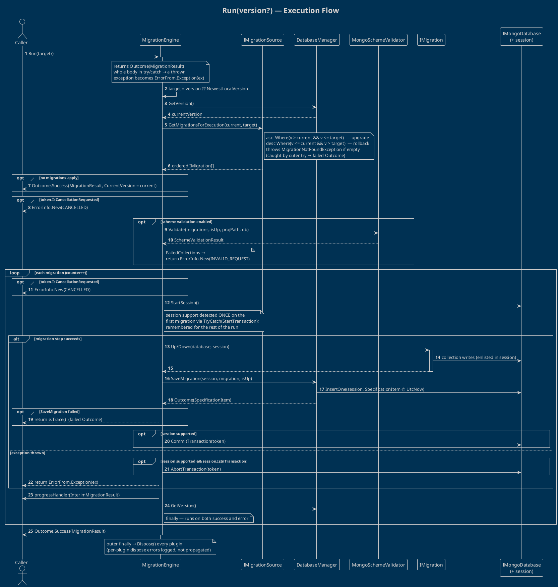

# Execution Flow — `Run(version?)`

> [!info] Companion to [[README]]
> This note traces exactly what happens when a caller invokes `MigrationEngine.Run(...)`. Class‑level detail lives in the [[README#4. Modules|Modules]] section.

> [!note] Result model (2.0.0)
> As of 2.0.0, `Run()` returns an **`Outcome<MigrationResult>`** (from **RZ.Foundation**). The happy path yields a success `Outcome` wrapping `MigrationResult`; cancellation, schema‑validation, and migration failures are **returned as error values** (`ErrorInfo.New(...)` / `ErrorFrom.Exception(...)`) rather than thrown.

## Before `Run()` — what `UseDatabase` already did

`UseDatabase` runs *eagerly*, well before `Run()`:

1. Builds the `IMongoClient` — from a connection string **or** a caller‑supplied client.
2. Applies `SetTls(tlsSettings)` when `UseTls(cert)` was called.
3. Aggregates **every registered plugin's** `SetupMongoClient` over that client (e.g. the SSH tunnel rewriting the server endpoint to the local forwarded port).
4. Resolves the `IMongoDatabase` and constructs a **fresh** `MigrationEngine` carrying that database plus a new `DatabaseManager`, which creates/validates the `_migrations` collection and — for `MongoEmulationEnum.AzureCosmos` — the required ascending timestamp index.

The static constructor of `MigrationEngine` also registered `VersionStructSerializer` for BSON exactly once, process‑wide.

## The run

## Step notes

- **Result type:** `Run()` returns an `Outcome<MigrationResult>` (RZ.Foundation). Success carries the `MigrationResult`; failures are **returned as error values**, never thrown to the caller. The whole body is wrapped in a `try/catch` that converts any stray exception into `ErrorFrom.Exception(ex)`.
- **Direction** is `isUp = target > current`. Upgrades order migrations ascending; rollbacks descending.
- **Empty range short‑circuit:** if no migrations fall in range, the engine returns a success `Outcome` with `CurrentVersion = current`, *without opening any session*.
- **Validation is a hard gate:** when enabled, any `FailedCollections` makes the engine return `ErrorInfo.New(INVALID_REQUEST, …)` before a single migration executes.
- **Cancellation:** a requested token returns `ErrorInfo.New(CANCELLED)` — checked before the loop and again at the top of each iteration.
- **Session support is decided once:** on the first migration the engine probes `StartTransaction()` via `TryCatch`; the outcome is stored in `sessionSupported` and reused for every later migration (so a session‑less server — CosmosDB / DocumentDB — no longer fails mid‑run).
- **Audit write:** `SaveMigration(session, migration, isUp)` inserts a `SpecificationItem` (`n` name, `v` version, `d` direction, `applied` UTC timestamp) **within the migration's session**, returning an `Outcome<SpecificationItem>`; a failed insert short‑circuits the run via `e.Trace()`. The record is never updated or deleted.
- **Error handling:** an exception inside a step aborts the active transaction (when in one) and returns `ErrorFrom.Exception(ex)`; the per‑iteration `finally` still fires progress handlers and refreshes `CurrentVersion`.
- **Cleanup:** the outermost `finally` disposes every plugin registered on the running engine, swallowing (and logging) per‑plugin dispose errors.

## See also

- [[README]] — abstract, features, use cases, and the module architecture diagram
