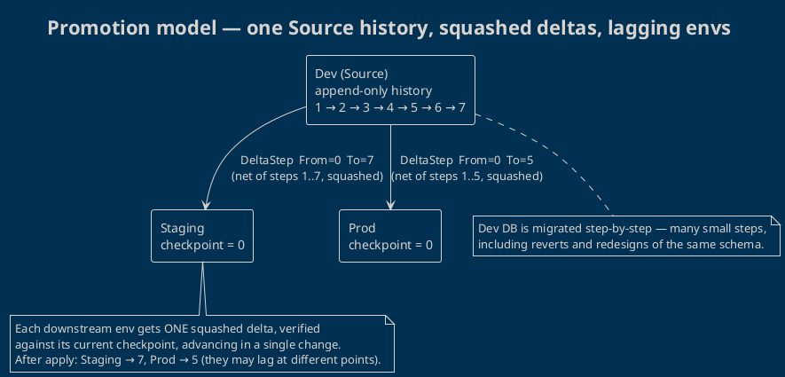
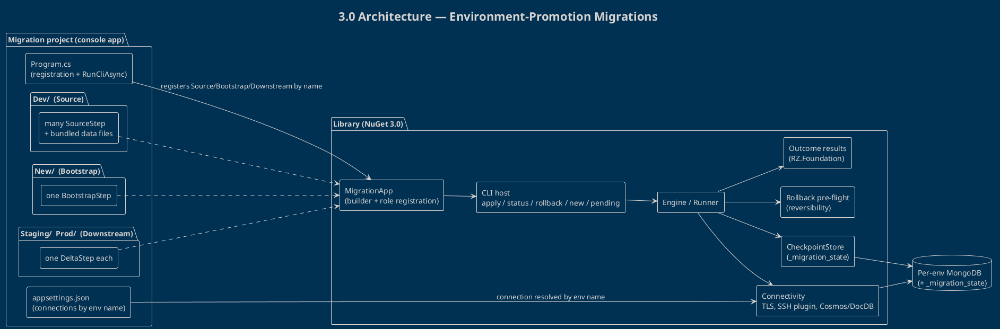
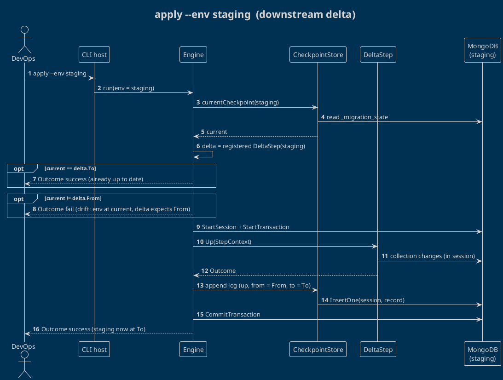
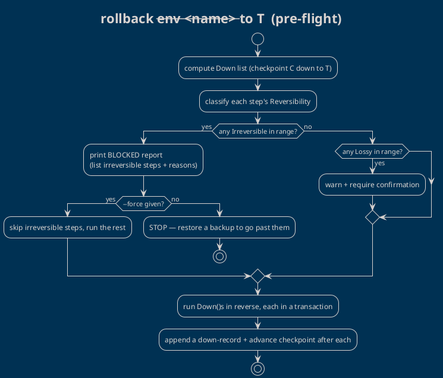

# Environment-Promotion Migrations (3.0) — Design

> [!abstract] Summary
> A ground-up redesign of **MongoDBMigrationsRZ** for **3.0**. It replaces the *embedded, reflection-discovered, version-targeted* migration model with an **environment-promotion** model: migrations are a standalone **DevOps console app**, steps are **explicitly registered** (no auto-scan), and each environment advances through **append-only checkpoints**. The library stays a NuGet package providing the engine, step base classes, checkpoint tracking, and a ready-made CLI host.
>
> This is a **breaking 3.0** — the 2.x `MigrationEngine`/`IMigration`/auto-scan API is removed. See [[README]] and [[Execution Flow]] for the 2.x model being replaced.

## 1. Problem & motivation

In real deployments, environments sit at **different schema checkpoints**: Dev is usually ahead of Staging, which is ahead of Prod. During development we make *many* small changes — some of which revert or redesign earlier ones. Replaying that churn onto Staging/Prod is noisy and risky; we want each downstream environment to receive a **single, clean, squashed change** that moves it forward.

The 2.x library doesn't fit this:

- It **auto-scans** an assembly/namespace for `IMigration` types. With one project serving several environments (each needing its own script set), reflection discovery is the wrong tool and is unnecessarily complicated.
- It assumes migrations are **embedded in an application** and applied by semantic version. We want the migration project to **be the application** — a tool DevOps runs.

## 2. Goals & non-goals

**Goals**
- Migrations are a standalone DevOps app; the library provides engine + base classes + CLI host.
- **No auto-scan.** Steps are explicitly registered in code (the dev/AI authors the list).
- One **append-only Source** history (many fine-grained steps) plus **N downstream** environments that each receive **one squashed delta**, plus a **bootstrap** that builds a fresh environment from empty.
- Each environment tracks its own **checkpoint** (a monotonic step id) in its own database.
- Steps are **C# logic** with optional **bundled data files**.
- **Up/Down** with honest **reversibility**: irreversibility is the default and is enforced at rollback time.
- **Errors as values** — every fallible library function returns `Outcome<T>`; the engine does not throw for expected failures (see §2.1).
- Reuse the proven 2.x plumbing: MongoDB C# driver, per-step sessions/transactions, `Outcome<T>` (RZ.Foundation), TLS, SSH tunnel, CosmosDB/DocumentDB support.

**Non-goals (this version)**
- The library does **not** generate the squashed delta. Authoring the delta is the dev/AI's job (aided by `pending`). The engine **executes and tracks**.
- **No schema validation.** The 2.x Roslyn/Buildalyzer validator is removed; a redesigned validation feature may return later (see §13).
- No backward compatibility with the 2.x API.

### 2.1 Error handling — errors as values

The engine follows an **errors-as-values** discipline built on `Outcome<T>` (RZ.Foundation); it does **not** throw exceptions for expected failures.

- **Every library function with an expected failure mode returns `Outcome<T>`** — checkpoint-id/argument parsing, configuration & connection validation, environment-name resolution, registration/build checks (one Source, unique ids), checkpoint-drift detection, "step not found", and the rollback irreversibility verdict.
- **Step bodies should return failures as values, not throw.** By convention a step wraps its MongoDB operations in the `TryCatch` helper, which converts a thrown driver error into a failed `Outcome` — so `Up`/`Down` hand back an `ErrorInfo`/`Outcome` failure instead of throwing, without manually threading `Outcome` through every line.
- **The outer catch-all boundary is the safety net:** if an exception still escapes a step, the engine converts it into a failed `Outcome` (as `Run` does via `ErrorFrom.Exception`) **and logs a warning** that the step threw instead of returning an error value — flagging the deviation so the author wraps that operation in `TryCatch`.
- **Throwing is reserved for genuine programmer errors**, and even those are caught at the boundary so the process exits cleanly with a non-zero code rather than an unhandled stack trace.
- **The CLI maps the final `Outcome` to a process exit code** (0 = success, non-zero = failure) and prints the error — so every command is CI/CD-friendly.

This deliberately retires the 2.x `try/catch`-and-throw style (`Version` parse exceptions, config-setter argument guards, validator/locator throws) that still lingers after `Outcome<T>` was introduced.

## 3. Core concepts

| Concept | Meaning |
|---|---|
| **Role** | What an environment *is* to the engine: **Source**, **Bootstrap**, or **Downstream**. The library knows roles, never specific names. |
| **Environment name** | A project-chosen string (`"dev"`, `"staging"`, `"prod-eu"`, …) bound to a role + step(s) in code, to a connection in config, and selected via `--env` on the CLI. |
| **Source** | Exactly one. The append-only ordered history of `SourceStep`s. Each step has a **monotonic `Id`**. |
| **Bootstrap** | Zero or one. A single `BootstrapStep` that builds a fresh database to the Source's current structure, stamping its checkpoint to the Source's current id. |
| **Downstream** | Any number. Each has a single `DeltaStep` declaring `From → To` checkpoints — the squashed net change since that environment was last promoted. |
| **Checkpoint** | A monotonic id recording how far an environment has advanced. Stored append-only in a `_migration_state` collection in that environment's own database. |
| **Reversibility** | `Reversible` / `Lossy` / `Irreversible` (default). Drives the rollback pre-flight. |

### 3.1 Promotion model



## 4. Architecture



## 5. The Step model

The role is encoded in the base class, so the compiler keeps a `SourceStep` out of a downstream slot, etc. **Irreversibility is the default** — a step is `Irreversible` with a non-working `Down` unless it explicitly opts in.

```csharp
public abstract class MigrationStep
{
    public abstract string Name { get; }

    // Honest by default — opt in to reversibility.
    public virtual Reversibility Reversibility => Reversibility.Irreversible;
    public virtual string? IrreversibleReason => null;

    public abstract Outcome<Unit> Up(StepContext ctx);
    public virtual Outcome<Unit> Down(StepContext ctx) => StepErrors.NotReversible(Name);
}

public enum Reversibility { Reversible, Lossy, Irreversible }

// Source: append-only history, identified by a monotonic id.
public abstract class SourceStep : MigrationStep
{
    public abstract long Id { get; }            // strictly increasing across the Source list
}

// Downstream: a squashed delta bridging a checkpoint range.
public abstract class DeltaStep : MigrationStep
{
    public abstract long From { get; }          // env MUST currently be here
    public abstract long To   { get; }          // env will be here after Up
}

// Bootstrap: build a fresh DB to the Source's current structure.
public abstract class BootstrapStep : MigrationStep
{
    public abstract long To { get; }            // = Source's current Id at authoring time
}
```

### 5.1 StepContext (DB, session, bundled data)

Every step runs inside a per-step session/transaction and can read the data files bundled with it.

```csharp
public sealed class StepContext
{
    public IMongoDatabase Database { get; }
    public IClientSessionHandle Session { get; }   // per-step transaction (degrades gracefully, as in 2.x)
    public CancellationToken Cancellation { get; }

    public Stream OpenData(string relativePath);   // resolves a file bundled with this step
    public string DataDirectory { get; }           // e.g. <env>/data/<stepId>/
}
```

**Data-file convention:** on disk, copied to output, resolved by step id — e.g. `Dev/data/0007/countries.json`, opened as `ctx.OpenData("countries.json")`. (Embedded resources can be added later if a single-file deploy is needed; not required for v3.0.)

Per the errors-as-values discipline (§2.1), the engine runs each `Up`/`Down` inside a catch-all boundary, so a thrown driver exception becomes a failed `Outcome`. `OpenData` may throw for a missing file and is caught the same way; a `TryOpenData` returning `Outcome<Stream>` is available when a step wants to handle a missing file explicitly.

## 6. Registering environments (the thin app)

The library knows **roles**, not names. Names are project-chosen and thread through three places by the **same string**: registration (code) ↔ connection (config) ↔ `--env` (CLI).

```csharp
// Program.cs
return await MigrationApp.Create(args)
    .Source("dev", d => d
        .Step(new _0001_CreateClients())
        .Step(new _0002_RenameNameToFirstName())
        .Step(new _0007_SeedCountries()))          // ids strictly increasing, append-only
    .Bootstrap("new", new _BuildToCurrent())        // zero or one, single step
    .Downstream("staging", new _Staging_0_to_7())   // any number, single DeltaStep each
    .Downstream("prod",    new _Prod_0_to_5())
    .UseConnections(configuration)                  // standard .NET IConfiguration
    .RunCliAsync();                                 // parses the command + --env
```

**Constraints the engine enforces:** exactly one Source; at most one Bootstrap; any number of Downstream; every `--env` must resolve to a registered name; Source step `Id`s must be strictly increasing and unique. These checks run when the app is built and a violation yields a **failed `Outcome`** (surfaced by `RunCliAsync` as a non-zero exit), never an exception (§2.1).

## 7. Connection configuration

Connections (and per-environment TLS/SSH/Cosmos options) live in standard .NET configuration, keyed by the **same name** used in registration:

```jsonc
{
  "Migrations": {
    "Environments": {
      "dev":     { "ConnectionString": "mongodb://localhost/app_dev" },
      "staging": { "ConnectionString": "mongodb://.../app_staging", "Emulation": "None" },
      "prod":    { "ConnectionString": "mongodb://.../app_prod",    "Tls": { "CertPath": "..." } }
    }
  }
}
```

- Override at the CLI with `--connection "<conn>"` (this is how `new` targets a brand-new DB not yet in config).
- Secrets come from env vars / user-secrets / a secret store via the normal `IConfiguration` providers — never committed.

## 8. Checkpoint tracking

Each environment's **own** database holds a `_migration_state` collection — an **append-only log**. The current checkpoint is the `to` of the last successful record.

```jsonc
// _migration_state document
{
  "seq":          42,              // ordinal in the log
  "stepName":     "Seed countries reference data",
  "role":         "downstream",    // source | bootstrap | downstream
  "direction":    "up",            // up | down
  "from":         0,               // checkpoint before this op
  "to":           7,               // checkpoint after  (Id/To for up; From for down)
  "reversibility":"Reversible",
  "appliedAtUtc": "2026-06-29T10:00:00Z",
  "durationMs":   812,
  "ok":           true,
  "error":        null
}
```

- **Current checkpoint** = last `ok` record's `to`.
- **Pending (Source)** = Source steps whose `Id > current`, in `Id` order.
- **Pending (Downstream)** = the registered delta, *iff* `current == delta.From` and `current != delta.To`.

## 9. Execution flows

### 9.1 `apply --env staging` (downstream delta)



### 9.2 `apply --env dev` (source history)
Run every Source step with `Id > current`, in `Id` order; each in its own transaction, advancing the checkpoint to that step's `Id`. Identical per-step session/commit/abort semantics to 2.x.

### 9.3 `new --env <name>` / `new --connection <conn>` (bootstrap)
Verify the target database is **empty/uninitialized** (no checkpoint). Run the single `BootstrapStep.Up`, then stamp the checkpoint to its `To` (the Source's current id). Refuse if the target already has a checkpoint (use `apply` instead).

### 9.4 `rollback --env <name> --to T` (pre-flight + reversibility)



Example blocked output:

```
Rollback staging  7 → 2  BLOCKED.
  ✗  step 5  "Drop legacy audit collection"   IRREVERSIBLE — data is gone
  ✓  step 6  "Rename field"                    Reversible
Restore a backup to roll back past step 5, or re-run with --force to skip irreversible steps.
```

## 10. CLI surface

| Command | Behaviour |
|---|---|
| `status --env <name>` | current checkpoint, pending range, reversibility summary |
| `apply --env <name> [--to <id>]` | Source: run pending steps in id order. Downstream: verify `From`, run the single delta, set `To` |
| `rollback --env <name> --to <id> [--force]` | pre-flight (§9.4), then run `Down`s in reverse |
| `new --env <name> \| --connection <conn>` | run the bootstrap against a fresh DB → checkpoint = Source current |
| `pending --env <name>` | list Source steps not yet incorporated into this env (feeds the AI authoring the squash) |
| `backup --env <name> [--out <dir>]` | `mongodump` snapshot (pairs with rollback pre-flight) |
| `restore --env <name> --from <dir>` | `mongorestore --drop` |

All commands return an `Outcome` and a non-zero process exit code on failure, so they drop cleanly into CI/CD.

## 11. Project layout

```
MyApp.Migrations/                 (console app — references the 3.0 NuGet library)
├── Program.cs                    registration + RunCliAsync
├── appsettings.json              connections by env name
├── Dev/                          Source — many steps, append-only
│   ├── _0001_CreateClients.cs
│   ├── _0002_RenameNameToFirstName.cs
│   ├── _0007_SeedCountries.cs
│   └── data/0007/countries.json  bundled data for step 7
├── New/                          Bootstrap — one step
│   └── _BuildToCurrent.cs
├── Staging/                      Downstream — one delta
│   └── _Staging_0_to_7.cs
└── Prod/                         Downstream — one delta
    └── _Prod_0_to_5.cs
```

The folder names are organizational; the **authoritative identity is the registered name**.

## 12. Worked example

### 12.1 A Source step with bundled data

```csharp
public sealed class _0007_SeedCountries : SourceStep
{
    public override long Id => 7;
    public override string Name => "Seed countries reference data";
    public override Reversibility Reversibility => Reversibility.Reversible;

    public override Outcome<Unit> Up(StepContext ctx)
    {
        using var stream = ctx.OpenData("countries.json");
        var docs = BsonSerializer.Deserialize<List<BsonDocument>>(new StreamReader(stream).ReadToEnd());
        ctx.Database.GetCollection<BsonDocument>("countries").InsertMany(ctx.Session, docs);
        return Unit.Default;
    }

    public override Outcome<Unit> Down(StepContext ctx)
    {
        ctx.Database.GetCollection<BsonDocument>("countries")
           .DeleteMany(ctx.Session, FilterDefinition<BsonDocument>.Empty);
        return Unit.Default;
    }
}
```

### 12.2 A downstream delta (AI-squashed, `0 → 7`)

```csharp
public sealed class _Staging_0_to_7 : DeltaStep
{
    public override long From => 0;
    public override long To   => 7;
    public override string Name => "Promote staging to dev checkpoint 7";
    public override Reversibility Reversibility => Reversibility.Lossy;   // honest: data shape changed

    public override Outcome<Unit> Up(StepContext ctx)
    {
        // Net effect of Dev steps 1..7, squashed: create `clients` with `firstName`,
        // ensure index, seed `countries`. (Reverts/redesigns from Dev are already collapsed out.)
        // ...
        return Unit.Default;
    }
    // Down omitted → falls back to NotReversible; pre-flight will surface it.
}
```

### 12.3 A promotion session

```text
$ dotnet run -- status --env staging
staging  checkpoint=0   pending: delta 0 → 7 (Lossy)

$ dotnet run -- apply --env staging
✓ staging  delta 0 → 7 applied in 1.2s   checkpoint=7

$ dotnet run -- status --env prod
prod     checkpoint=0   pending: delta 0 → 5 (Lossy)
```

## 13. What changes vs 2.x

| Area | 2.x | 3.0 |
|---|---|---|
| Discovery | reflection auto-scan (`MigrationLocator`, assembly/namespace `IMigrationSource`) | **explicit registration by role + name** |
| Unit | `IMigration` (`Up`/`Down(db, session)`) | `MigrationStep` / `SourceStep` / `DeltaStep` / `BootstrapStep` |
| Targeting | semantic `Version`, `Run(version)` | **append-only checkpoint ids**, per-env delta `From → To` |
| Tracking | `_migrations` + `SpecificationItem` (`DatabaseManager`) | `_migration_state` + `CheckpointStore` (id-based) |
| Entry point | `MigrationEngine` fluent | `MigrationApp` builder + `RunCliAsync` CLI host |
| Schema validation | Roslyn/Buildalyzer (`MongoSchemeValidator`) | **removed** (future redesign) |
| Result model | `Outcome<MigrationResult>` (some code still throws) | **errors as values throughout** — every fallible function returns `Outcome<T>`; no throwing for expected failures (§2.1) |
| Connectivity | TLS, SSH plugin, Cosmos/DocDB emulation | **kept** |

**Removed types:** `MigrationEngine`, `IMigration`, `MigrationLocator`, `IMigrationSource`/`MigrationSource`, `MongoSchemeValidator` + Roslyn walker (+ the `Buildalyzer` dependency), `IgnoreMigrationAttribute`, version-target `Run`.

**Reused (adapted):** per-step session/transaction loop, `Outcome<T>`, `UseTls`, `DatabaseSshTunnelPlugin` + plugin host, `MongoEmulationEnum`, the MongoSandbox test harness.

This is a **breaking 3.0**; the 2.x public API is removed (no parallel/deprecated engine).

## 14. Testing strategy

- Keep **MongoSandbox** (single-node replica set) for integration tests; transactions require it.
- Cover: Source apply (many steps, append-only ordering), Downstream apply with `From`/`To` **drift rejection** and **already-up-to-date** short-circuit, Bootstrap on empty vs non-empty DB, **rollback pre-flight** (blocked on Irreversible, warn on Lossy, `--force` path), checkpoint derivation from the log, session-less degradation (Cosmos/DocDB), and data-file resolution.
- Each behaviour asserted via the `Outcome` result and the `_migration_state` contents.

## 15. Open questions & future work

- **Schema validation** returns later as a separate, redesigned feature (not Roslyn-coupled).
- Bootstrap/Downstream are modeled as a **single step** each (matching "always one step"); revisit only if a real need for multi-step bootstraps appears.
- Embedded-resource data files (single-file publish) — defer until needed.

## See also
- [[README]] — current (2.x) library overview being replaced
- [[Execution Flow]] — current (2.x) `Run()` execution model
