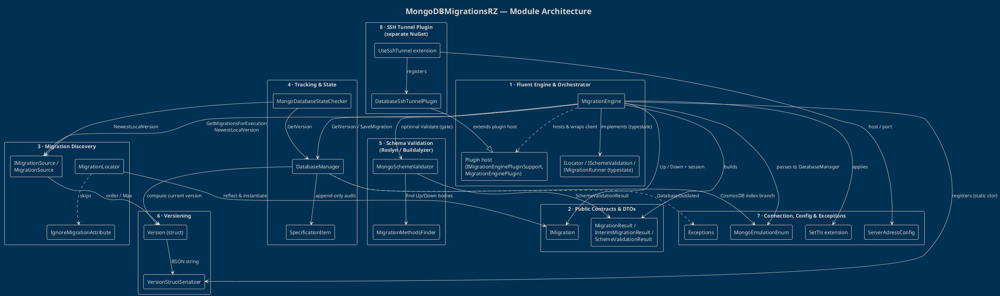

# MongoDBMigrationsRZ

> [!abstract] What this is
> **MongoDBMigrationsRZ** is a **.NET 10** library for running **versioned MongoDB schema migrations** through a compiler‑guided *fluent API*. It is a maintained fork of the original [MongoDBMigrations](https://bitbucket.org/i_am_a_kernel/mongodbmigrations/src/master/), published on NuGet as [MongoDBMigrationsRZ](https://www.nuget.org/packages/MongoDBMigrationsRZ).

## 1. Abstract

Migration authors implement a small `IMigration` contract — `Version`, `Name`, `Up(database, session)`, `Down(database, session)` — and the library discovers those implementations by reflection, computes the *exact ordered set* of migrations needed to move a database from its **current version** to a **target version** (rolling forward **or** back), applies each one inside its own MongoDB **client session/transaction**, and records an **append‑only audit trail** in a tracking collection (default `_migrations`). The run returns an `Outcome<MigrationResult>` (from **RZ.Foundation**), so failures surface as values rather than exceptions.

The core problem it solves is **safe, repeatable, near‑zero‑downtime evolution of MongoDB document schemas** across environments and CI/CD pipelines. It always knows which migrations have been applied, can tell an application at startup whether its database is behind the code (`IsDatabaseOutdated` / `ThrowIfDatabaseOutdated`), and can optionally **pre‑validate** — via Roslyn/Buildalyzer static source analysis — that every collection a migration touches contains structurally consistent documents *before* any change is made, aborting the run on inconsistency.

The library is built for **heterogeneous MongoDB targets**: standard on‑premise MongoDB, **Azure CosmosDB** (Mongo API), and **AWS DocumentDB**. A `MongoEmulationEnum` selects the flavor so the engine can apply provider‑specific quirks — most notably auto‑creating/validating the timestamp index CosmosDB requires, and degrading from sessions/transactions to session‑less execution on servers that lack session support. An extensible **plugin host** lets third‑party assemblies wrap or replace the `IMongoClient`; the shipped **`MongoDbMigrations.SshTunnel`** package uses this to migrate a MongoDB server reachable only through an SSH bastion via local port forwarding.

The engine targets `net10.0`, derives NuGet package versions from git tags via **MinVer**, and ships its integration test suite on **MongoSandbox** (an in‑process single‑node replica set — Windows / `win‑x64` only, since transactions require a replica set).

> See [[Execution Flow]] for a step‑by‑step sequence of what happens during a `Run()`.

## 2. Features

### Core migration engine

1. **Fluent typestate builder API** — A compiler‑guided call chain (`UseDatabase` → `ILocator` → `ISchemeValidation` → `IMigrationRunner` → `Run`) whose *return types* force a valid configuration order at compile time.
2. **Roll‑forward and rollback migrations** — Moves a database between its current version and any target version, applying `Up` migrations ascending or `Down` migrations descending; `Run()` with no target migrates to the newest local version.
3. **Reflection‑based migration discovery** — Finds `IMigration` implementations from an assembly, a single exact namespace, a direct array, or the auto‑detected caller assembly. Assembly and namespace scans skip `abstract` and `[IgnoreMigration]` types (a directly supplied array is used as-is).
4. **Semantic versioning with string ergonomics** — A `Major.Minor.Revision` `Version` struct with full ordering, a `Zero` sentinel, a validating parser, and implicit `string ⇄ Version` conversions so callers can write `Run("1.2.0")`.
5. **Per‑migration sessions/transactions** — Each migration executes inside its own MongoDB client session/transaction, degrading to session‑less execution when the server (CosmosDB / DocumentDB) lacks session support.
6. **Session passed to migrations** — `Up`/`Down` receive the active `IClientSessionHandle` so migration code can enlist its own writes in the transaction (added in v1.4.0).

### Tracking, safety & validation

7. **Applied‑migration audit trail** — Appends a record of every up/down migration (name, version, direction, UTC timestamp) to a tracking collection that is never updated or deleted — an append‑only history.
8. **Current‑version computation with rollback unwinding** — Derives the database's current semantic version from applied history, correctly reporting the version *rolled back to* when the last record is a `Down` migration.
9. **Database‑outdated startup gate** — `MongoDatabaseStateChecker` lets an app check or assert at startup whether its database is behind the migrations packaged in an assembly (`IsDatabaseOutdated` / `ThrowIfDatabaseOutdated`).
10. **Static schema‑consistency validation** — Optionally uses Roslyn/Buildalyzer to find which collections each migration touches and **fails fast** if those collections contain structurally inconsistent documents *before* any change is applied.
11. **Cooperative cancellation** — A `CancellationToken` is checked before the loop and at the start of each migration; a requested cancellation returns a failed `Outcome` (`CANCELLED`) instead of throwing, and the token is passed to commit/abort calls.
12. **Progress reporting** — Registered `Action<InterimMigrationResult>` handlers fire after every step, reporting current/total counts, name, target version, and server/database.

### Platform & connectivity

13. **Multi‑flavor MongoDB support** — Targets standard on‑premise MongoDB, Azure CosmosDB (Mongo API), and AWS DocumentDB via a `MongoEmulationEnum` that gates provider‑specific behavior.
14. **CosmosDB index handling** — Auto‑creates the required ascending index on the applied‑timestamp field on first run and verifies its presence on later runs for Azure CosmosDB targets.
15. **Extensible plugin host** — Third‑party assemblies register `MigrationEnginePlugin` instances that wrap or replace the `IMongoClient` during connection setup.
16. **SSH‑tunneled migrations** — The `MongoDbMigrations.SshTunnel` package migrates a MongoDB server reachable only through an SSH bastion, with password or private‑key auth and automatic local port forwarding.
17. **Client‑certificate TLS** — Optional TLS configuration via `UseTls(X509Certificate2)`, applied to the client before any plugin wrapping.
18. **Customizable tracking collection name** — The specification/tracking collection defaults to `_migrations` but can be overridden via `UseCustomSpecificationCollectionName`.

### Tooling & delivery

19. **CI/CD backup‑and‑rollback runner** — `MongoDBRunMigration.ps1` `mongodump`‑backs‑up before running, reflection‑loads and executes the engine, and `mongorestore --drop` rolls back then re‑throws on any failure.
20. **Git‑tag‑driven packaging & in‑process tests** — **MinVer** derives NuGet package versions from git tags and `build.ps1` packs both library packages with one command; **MongoSandbox** boots an in‑process single‑node replica set (required for transactions) with auto‑incrementing isolated per‑test databases.

## 3. Use Cases

> [!example] Highlight scenarios

1. **Zero‑downtime schema migration in CI/CD** — A deployment pipeline calls `MongoDBRunMigration.ps1`, which `mongodump`‑backs‑up the database, runs the fluent engine (`UseDatabase().UseAssembly().UseSchemeValidation(false).Run()`) to migrate to the newest local version, and `mongorestore --drop` rolls back automatically if any migration throws.
2. **Application‑startup version gate** — On boot, an application calls `MongoDatabaseStateChecker.ThrowIfDatabaseOutdated(connStr, db, migrationAssembly)` so it refuses to start (or triggers a migration) when the database version is behind the migrations shipped in the code.
3. **Transactional rollback to a target version** — An operator calls `Run("1.2.0")` against a database at a higher version; the engine selects the `Down` migrations in descending order, executes each in its own transaction, and records the rollback, leaving the database reporting the rolled‑back‑to version.
4. **Azure CosmosDB / AWS DocumentDB migration** — Passing `MongoEmulationEnum.AzureCosmos` (or `AwsDocument`) to `UseDatabase` makes the engine auto‑create/validate the CosmosDB timestamp index and tolerate the lack of session support, applying migrations on managed Mongo‑API services.
5. **SSH‑tunneled migration to a bastioned server** — A developer chains `engine.UseSshTunnel(sshAddress, user, key, mongoAddress).UseDatabase(...).Run()`, opening an SSH local port‑forward so the engine transparently migrates a MongoDB server that is only reachable through a jump host.

## 4. Modules

The code physically lives in folders/namespaces such as `Core`, `Document`, `Contracts`, and `Exception`, but those names are **not reliable guides to concept** (see the warning below). The following nine **conceptual modules** describe what the code actually *does*.

| # | Module | Concept | Key types |
|---|--------|---------|-----------|
| 1 | **Fluent Engine & Orchestrator** | Public entry point; drives the whole run | `MigrationEngine`, `ILocator`, `ISchemeValidation`, `IMigrationRunner`, `IMigrationEnginePluginSupport` |
| 2 | **Public Contracts & Result DTOs** | The authoring contract + plain result objects | `IMigration`, `MigrationResult`, `InterimMigrationResult`, `SchemeValidationResult` |
| 3 | **Migration Discovery** | Find migrations & select the ordered subset | `IMigrationSource`, `MigrationSource`, `MigrationLocator`, `IgnoreMigrationAttribute` |
| 4 | **Applied‑Migration Tracking & State** | Persist audit log; answer "what version / outdated?" | `DatabaseManager`, `SpecificationItem`, `MongoDatabaseStateChecker` |
| 5 | **Schema Validation** | Static source analysis → collection consistency check | `MongoSchemeValidator`, `MigrationMethodsFinder` |
| 6 | **Versioning** | Semantic‑version value type + BSON serializer | `Version`, `VersionStructSerializer` |
| 7 | **Connection, Config & Exceptions** | TLS, emulation selector, endpoint DTO, exceptions | `SetTls` ext., `MongoEmulationEnum`, `ServerAdressConfig`, exception types |
| 8 | **SSH Tunnel Plugin** *(separate NuGet)* | Reference plugin — migrate through an SSH bastion | `MigrationEngineExtensions` (`UseSshTunnel`), `DatabaseSshTunnelPlugin`, `MigrationEnginePlugin` |
| 9 | **Build, Packaging & Tests** | Compile, version, pack, deploy, integration‑test | `build.ps1`, `MongoDBRunMigration.ps1`, `MongoDaemon`, the three `.csproj` |

### Module relationship diagram

### Module-by-module

> [!note]- 1 · Fluent Engine & Orchestrator
> `MigrationEngine` is a **sealed** orchestrator implementing four *segregated* interfaces, so each builder method returns the next legal stage. `UseDatabase` resolves the client (applying `SetTls` then aggregating every plugin's `SetupMongoClient`) and returns a fresh engine carrying the resolved `IMongoDatabase` and a `DatabaseManager`. `RunInternal` reads the current version, asks the source for the ordered set, optionally runs scheme validation as a gate, then iterates each migration in its own session/transaction (`Up`/`Down` → `SaveMigration` → commit, or abort on error), fires progress handlers, and disposes plugins in a `finally`. It returns an **`Outcome<MigrationResult>`** (RZ.Foundation), surfacing cancellation, scheme-validation, and step failures as error values instead of throwing. A static constructor registers `VersionStructSerializer` exactly once.

> [!note]- 2 · Public Contracts & Result DTOs
> `IMigration` is the contract authors implement (`Version`, `Name`, `Up(database, session)`, `Down(database, session)`). `MigrationResult` carries the final outcome, per‑step history, server/db, and `Success`; `InterimMigrationResult` is a per‑step progress event; `SchemeValidationResult` accumulates valid/failed collection lists. `Run()` returns the `MigrationResult` wrapped in an **`Outcome<MigrationResult>`** (RZ.Foundation), so failures come back as error values rather than thrown exceptions. These types are nearly behavior‑free data carriers.

> [!note]- 3 · Migration Discovery
> `MigrationLocator` scans an assembly (optionally one *exact* namespace) by reflection, instantiating non‑abstract, non‑`[IgnoreMigration]` `IMigration` types via `Activator.CreateInstance`, and can stack‑walk to auto‑detect the caller's assembly. `IMigrationSource`/`MigrationSource` wrap a *lazily* evaluated migration array with a description, expose `NewestLocalVersion`, and implement `GetMigrationsForExecution` — the directional, sorted selection (ascending for upgrade, descending for rollback) that throws `MigrationNotFoundException` when a target is missing or the range is empty.

> [!note]- 4 · Applied‑Migration Tracking & State
> `DatabaseManager` owns the `_migrations` collection: ensures it exists, appends a `SpecificationItem` for each applied migration via `SaveMigration(session, …)` — the audit insert is enlisted in the migration's session and returns an `Outcome<SpecificationItem>`, so a failed insert aborts the run — and derives the current `Version` from history — correctly unwinding a trailing `Down`. It also creates/validates the CosmosDB timestamp index. `MongoDatabaseStateChecker` is a stateless static façade comparing DB version to the newest available migration version.

> [!note]- 5 · Schema Validation (Roslyn / Buildalyzer)
> `MongoSchemeValidator` opens a Roslyn workspace over the migration project's `.csproj` via Buildalyzer, uses `MigrationMethodsFinder` (a `CSharpSyntaxWalker`) to locate the targeted `Up`/`Down` method *bodies*, resolves invocations against a configurable `MethodMarkers` set (`GetCollection`, `CreateCollection`, …) to extract string‑literal collection names, then asserts every document in each collection shares an identical ordered `element‑name → BsonType` map. Any failed collection aborts the run.

> [!note]- 6 · Versioning
> `Version` is a `readonly struct` (`Major.Minor.Revision`) with parsing‑with‑validation, full comparison/equality, a `Zero` sentinel, and implicit `string ⇄ Version` conversions for ergonomic fluent calls. `VersionStructSerializer` persists it to BSON as a single dotted string, registered globally once in `MigrationEngine`'s static constructor. Malformed strings raise `VersionStringTooLongException` or `InvalidVersionException`.

> [!note]- 7 · Connection, Config & Exceptions
> `IMongoClientExtensions.SetTls` opt‑in enables TLS when `SslSettings` are supplied. `MongoEmulationEnum` selects the target flavor (`None` / `AzureCosmos` / `AwsDocument`). `ServerAdressConfig` models and validates a host/port endpoint. Exceptions (`DatabaseOutdatedException`, `MigrationNotFoundException`, plus the version exceptions) signal outdated databases, missing migrations, and malformed versions.

> [!note]- 8 · SSH Tunnel Plugin (separate NuGet)
> `DatabaseSshTunnelPlugin` extends the core `MigrationEnginePlugin`: it overrides `SetupMongoClient` to repoint the client at a locally bound forwarded port, and `Dispose` to tear down the SSH client. `MigrationEngineExtensions` provides the fluent `UseSshTunnel` entry points (password or private‑key auth), opens the SSH connection, starts a `127.0.0.1` local port‑forward to the remote MongoDB, and registers the plugin via the engine's plugin host. The package deliberately reuses the core `MongoDBMigrations` namespace so `UseSshTunnel` appears as part of the core API.

> [!note]- 9 · Build, Packaging & Tests
> Three `net10.0` projects (core library, SSH plugin, MSTest smoke tests) versioned by **MinVer** from git tags. `build.ps1` packs the two library projects to NuGet. `MongoDBRunMigration.ps1` is a CI/CD runner with `mongodump` backup and `mongorestore --drop` rollback. `MongoDaemon` boots one in‑process **MongoSandbox** single‑node replica set and hands out per‑test `ConnectionInfo` with auto‑incrementing database names.

> [!warning] Namespace ≠ concept — don't trust the folder names
> The physical layout is misleading in several places:
> - **`Contracts/` folder mixes namespaces.** `ILocator` / `IMigration` / `IMigrationRunner` / `ISchemeValidation` are in `MongoDBMigrations`, `InterimMigrationResult` is in `MongoDBMigrations.Core`, and `SchemeValidationResult` is in `MongoDBMigrations.Document` — same folder, three namespaces.
> - **`Document/` is not "domain documents."** `SpecificationItem` is a *persistence/tracking record*; `Version` / `VersionStructSerializer` are *value types* that suppress `CheckNamespace` and declare the root namespace despite living under `Document/`. `MongoEmulationEnum` and `ServerAdressConfig` are *config*, not documents.
> - **`Exception/` files declare the root namespace** (`CheckNamespace` suppressed), so the exceptions are *not* in a `*.Exception` namespace.
> - **The file `MongoCollectionCallInMigrationWallker.cs`** (note the *"Wallker"* typo) contains `MigrationMethodsFinder`, which finds `Up`/`Down` **method declarations** — *not* `GetCollection` calls. Collection‑name extraction happens in `MongoSchemeValidator.FindCollectionNames`.
> - **`VersionSerializer.cs` defines the class `VersionStructSerializer`** (filename ≠ type name), and the library's `Version` collides by name with `System.Version`.
> - **Permanent public misspellings** are part of the API surface: `ServerAdress`, `UseCancelationToken`, `ServerAdressConfig`.
> - **The SSH plugin's assembly is `MongoDbMigrations.SshTunnel`** but it overrides `RootNamespace` to `MongoDBMigrations`, so `UseSshTunnel` looks native to the core library.

## See also

- [[Execution Flow]] — sequence diagram and narrative of a single `Run()`
- Root [`README.md`](../README.md) — install instructions, fluent‑API steps table, and changelog
- [`CLAUDE.md`](../CLAUDE.md) — build/test commands and architecture notes
